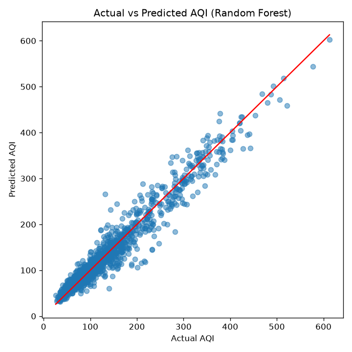
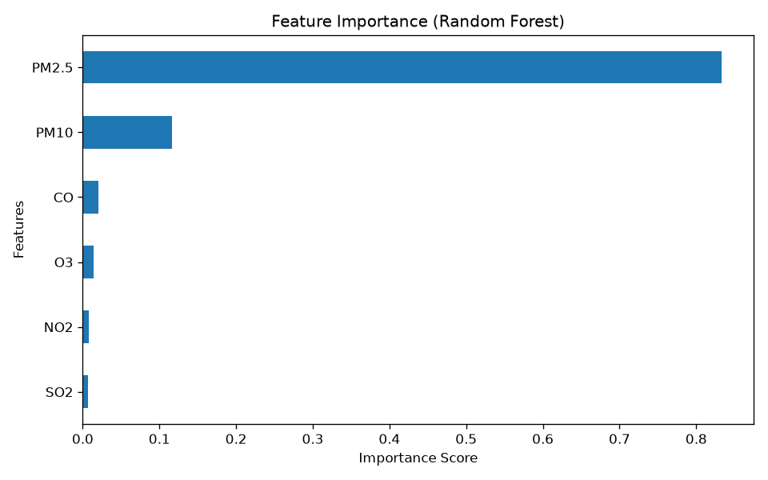

# Air Quality Index (AQI) Prediction

Predicts India's Air Quality Index (AQI) from pollutant concentrations using a
Random Forest Regressor, served through a Flask REST API.

## Overview

- **Data**: Historical pollutant readings for 26 Indian cities (2015–2020)
- **Model**: Random Forest Regressor (scikit-learn), compared against a Linear Regression baseline
- **Serving**: Flask API with input validation, structured error responses, and a health-check endpoint
- **Notebook**: `notebooks/analysis.ipynb` documents the full, executed training and evaluation workflow

## Project Structure

```
air-quality-prediction/
├── app.py                  # Flask API
├── requirements.txt        # Pinned dependencies
├── render.yaml             # Render deployment config
├── Procfile                # Process file (gunicorn)
├── data/
│   └── air_quality.csv     # Source dataset
├── model/
│   └── aqi_model.pkl       # Trained Random Forest model
├── notebooks/
│   └── analysis.ipynb      # Data exploration, training & evaluation
├── images/
│   ├── actual_vs_predicted.png
│   └── feature_importance.png
└── tests/
    └── test_app.py         # API tests
```

## Dataset

The dataset contains pollutant concentrations — PM2.5, PM10, NO, NO2, NOx, NH3,
CO, SO2, O3, Benzene, Toluene, Xylene — and AQI for 26 Indian cities between
2015 and 2020 (29,531 rows).

### Features Used

- PM2.5
- PM10
- NO2
- SO2
- CO
- O3

## Approach

1. Load and explore the dataset
2. Drop rows with missing values
3. Select the six pollutant features and the AQI target
4. Split into train/test sets (80/20, `random_state=42`)
5. Train a Random Forest Regressor (`n_estimators=100`, `random_state=42`)
6. Evaluate against a Linear Regression baseline
7. Visualize results
8. Save the trained model to `model/aqi_model.pkl`

The full, executed workflow is in `notebooks/analysis.ipynb`.

## Model Performance

| Model              | MAE   | R²    |
|--------------------|-------|-------|
| Random Forest      | 14.84 | 0.944 |
| Linear Regression  | 18.62 | 0.918 |

## Visualizations

### Actual vs Predicted AQI


### Feature Importance


## Tech Stack

- Python
- Pandas, NumPy
- Scikit-learn
- Matplotlib
- Flask + Gunicorn

## Running Locally

### 1. Clone the repository

```bash
git clone https://github.com/meranaamkhann/air-quality-prediction.git
cd air-quality-prediction
```

### 2. Create a virtual environment and install dependencies

```bash
python -m venv venv
source venv/bin/activate   # On Windows: venv\Scripts\activate
pip install -r requirements.txt
```

### 3. Run the app

```bash
python app.py
```

The API will be available at `http://127.0.0.1:5000/`.

## API Reference

### `GET /`
Returns basic service info, including whether the model loaded successfully.

### `GET /health`
Health check endpoint, useful for deployment platforms.

- `200` — model loaded and ready
- `503` — model failed to load

### `POST /predict`
Predicts AQI from pollutant readings.

**Request body** (all six fields required, numeric):

```json
{
  "PM2.5": 50,
  "PM10": 100,
  "NO2": 20,
  "SO2": 10,
  "CO": 1.2,
  "O3": 30
}
```

**Success response (`200`)**

```json
{ "Predicted_AQI": 121.43 }
```

**Error responses**

| Status | Cause                            | Example body |
|--------|----------------------------------|--------------|
| 400    | Missing field(s)                  | `{"error": "Missing required field(s)", "missing_fields": ["O3"], "required_fields": [...]}` |
| 400    | Non-numeric field(s)              | `{"error": "Field(s) must be numeric", "invalid_fields": ["PM2.5"]}` |
| 415    | Body is not JSON                  | `{"error": "Request body must be JSON with Content-Type: application/json"}` |
| 503    | Model not loaded                  | `{"error": "Model is not loaded on the server. Please try again later."}` |

### Example with `curl`

```bash
curl -X POST http://127.0.0.1:5000/predict \
  -H "Content-Type: application/json" \
  -d '{"PM2.5": 50, "PM10": 100, "NO2": 20, "SO2": 10, "CO": 1.2, "O3": 30}'
```

## Running Tests

```bash
pip install pytest
pytest
```

## Deployment (Render)

This repo includes a `render.yaml` for one-click deployment on [Render](https://render.com), a good fit for small Flask APIs like this one with a generous free tier.

1. Push this repo to GitHub.
2. Go to the [Render Dashboard](https://dashboard.render.com) → **New** → **Blueprint**.
3. Connect this repository — Render will detect `render.yaml` automatically.
4. Click **Apply**. Render installs dependencies (`pip install -r requirements.txt`) and starts the app with `gunicorn app:app`.
5. Once deployed, the API is live at `https://<your-service-name>.onrender.com`.

### Manual setup (if not using the Blueprint)

| Setting            | Value                              |
|--------------------|-------------------------------------|
| Environment        | Python 3                            |
| Build Command      | `pip install -r requirements.txt`   |
| Start Command      | `gunicorn app:app`                  |
| Health Check Path  | `/health`                           |

> Render's free tier spins down after inactivity and may take ~30–60 seconds to wake up on the next request.

## Future Improvements

- Improve predictions using deep learning models
- Add a simple web frontend for interactive predictions
- Revisit data cleaning: the current `dropna()` keeps only ~21% of rows (those with no missing values in *any* column); restricting it to just the modeling columns would retain significantly more training data
